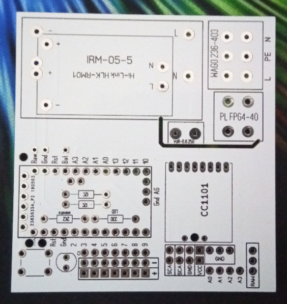

# HB-UNI-Bat-230V
Universal Platine 230V für Homematic 868Mhz
## benötigte Hardware
 * 1x Arduino Pro Mini **ATmega328P (3.3V/8MHz)**
 * 1x CC1101 Funkmodul **(868 MHz)**
 * 1x FTDI Adapter (wird nur zum Flashen benötigt)
 * 1x https://www.reichelt.de/my/1524957

[Kontakt via Facebook](https://www.facebook.com/ronny.thomas.83)

[Software je nach Projekt](https://github.com/jp112sdl) von Jérôme

Ab Version 1.1 gibt es einige Anpassungen.
 * Es kann entweder das Netzteil Meanwell IRM-05-5 oder Hi-Link HLK-RM01 verwendet werden.
 * Pinout wurde Angepasst: RAW Rins sind zusätzlich nach unten gelegt. für z.b. HB-UNI-Sen-PRESS

